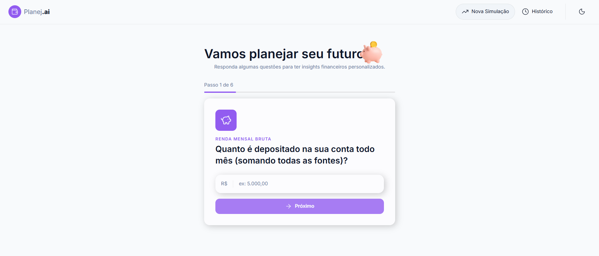
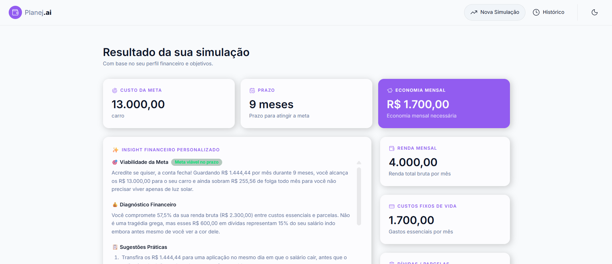
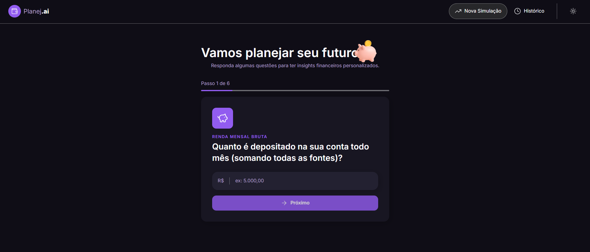
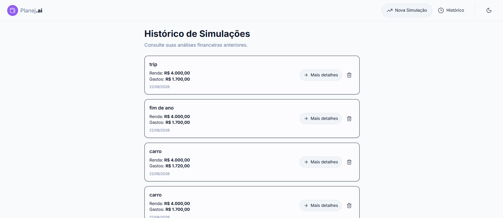

# Planej.ai 💸🤖

Educador Financeiro Inteligente desenvolvido com **React**, **TypeScript** e **IA Generativa**, como projeto final do desafio **Desenvolvendo Seu Educador Financeiro Inteligente com React e IA Generativa**, realizado durante o **Santander Bootcamp 2026 • React Front-End + IA Generativa**, da Digital Innovation One (DIO).

## 📌 Sobre o projeto

O **Planej.ai** é uma aplicação web desenvolvida para auxiliar pessoas no planejamento e organização da vida financeira por meio de simulações inteligentes.

O usuário informa sua **renda, gastos mensais e objetivo financeiro**. A aplicação utiliza a **Google Gemini API** para analisar essas informações e gerar um diagnóstico personalizado, acompanhado de recomendações práticas para auxiliar na tomada de decisões financeiras.

Como evolução do projeto original, foi implementado um **Histórico de Simulações**, permitindo consultar análises realizadas anteriormente, visualizar seus detalhes e excluir registros individualmente.

## 🚀 Minha contribuição

Como evolução do projeto proposto no desafio, desenvolvi individualmente a funcionalidade de **Histórico de Simulações**.

A funcionalidade utiliza `localStorage` para armazenar as simulações realizadas, permitindo que o usuário consulte posteriormente informações como:

- Objetivo financeiro;
- Renda;
- Gastos;
- Dados utilizados na simulação;
- Insights gerados pela IA.

Os dados permanecem disponíveis mesmo após a atualização da página, sem a necessidade de um banco de dados externo.

Essa implementação teve como objetivo ampliar a experiência do usuário e aplicar conceitos de **persistência de dados no Front-End**, gerenciamento de estado e organização de componentes em React.

## ✨ Funcionalidades

- Simulação financeira em etapas;
- Validação dos dados informados pelo usuário;
- Geração de insights utilizando IA Generativa (Google Gemini);
- Tema claro e escuro;
- Histórico de simulações;
- Visualização detalhada das simulações;
- Exclusão individual de registros;
- Persistência de dados utilizando `localStorage`;
- Navegação entre as diferentes etapas da aplicação.

## 🖥️ Demonstração

### Formulário de Simulação



### Resultado da Análise



### Tema Escuro



### Histórico de Simulações



## 🛠️ Tecnologias utilizadas

- **React 19**
- **TypeScript**
- **Vite**
- **Tailwind CSS v4**
- **React Router DOM**
- **Google Gemini API**
- **LocalStorage**

## ▶️ Como executar o projeto

### 1. Clone o repositório

```bash
git clone https://github.com/ianfequettia/Planej.ai.git
```

### 2. Acesse a pasta do projeto

```bash
cd planejai
```

### 3. Instale as dependências

```bash
pnpm install
```

### 4. Execute o servidor de desenvolvimento

```bash
pnpm dev
```

Após iniciar o servidor, acesse a URL exibida pelo Vite no terminal, geralmente:

```text
http://localhost:5173
```

## 🔄 Fluxo da aplicação

1. O usuário preenche os dados da simulação financeira;
2. A aplicação valida as informações fornecidas;
3. Os dados são utilizados para construir um prompt estruturado;
4. O prompt é enviado para a Google Gemini API;
5. A IA gera recomendações e insights personalizados;
6. O resultado é apresentado ao usuário;
7. A simulação é armazenada no `localStorage`;
8. O usuário pode consultar posteriormente suas simulações através do Histórico.

## 📚 Aprendizados

Durante o desenvolvimento deste projeto, pratiquei conceitos importantes de desenvolvimento Front-End, incluindo:

- Estruturação de aplicações utilizando React;
- Criação e reutilização de componentes;
- Utilização de TypeScript para tipagem;
- Gerenciamento de estado e Hooks;
- Criação de rotas utilizando React Router DOM;
- Estilização e criação de temas utilizando Tailwind CSS v4;
- Integração de uma aplicação React com uma API de IA Generativa;
- Estruturação de prompts para geração de respostas;
- Persistência de dados no navegador utilizando `localStorage`;
- Organização e manutenção de uma aplicação desenvolvida com Vite.

Além da implementação inicial proposta no desafio, a criação do **Histórico de Simulações** permitiu aprofundar meus conhecimentos em persistência de dados no Front-End e na construção de uma funcionalidade completa, envolvendo armazenamento, recuperação, visualização e exclusão de dados.

## 📁 Estrutura do projeto

```text
src/
├── components/
├── pages/
│   ├── SimulationFormPage
│   ├── SimulationResultsPage
│   └── SimulationHistoryPage
├── services/
├── styles/
├── router.tsx
└── main.tsx
```

## 🎯 Próximos passos

- [ ] Adicionar banco de dados para persistência das simulações;
- [ ] Implementar autenticação de usuários;
- [ ] Permitir edição e reutilização de simulações anteriores;
- [ ] Adicionar gráficos para visualização dos dados financeiros;
- [ ] Melhorar a responsividade para diferentes dispositivos;
- [ ] Adicionar testes automatizados.

## 👨‍💻 Autor

Desenvolvido por **Ian Fequettia** ☕✨

Projeto desenvolvido como parte do **Santander Bootcamp 2026 • React Front-End + IA Generativa**, da Digital Innovation One (DIO).
